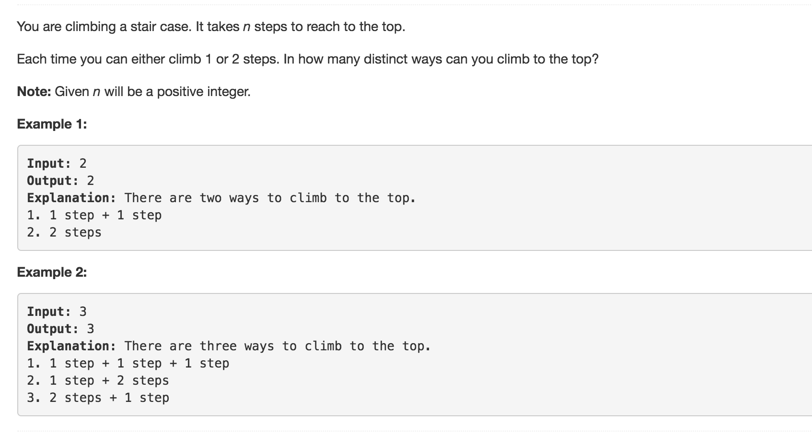

```python
class Solution:
	def climbStairs(self, n):
		"""
		:type n: int
		:rtype: int
		"""
		from collections import defaultdict

		tracks = defaultdict(int)
		tracks[0] = 0
		tracks[1] = 1
		tracks[2] = 2

		return self.foo(n,tracks)

	def foo(self,n,tracks):
		'''
		f(n) = f(n-1) + f(n-2) 
		'''
		if tracks[n] > 0:
			return tracks[n]
		else:
			tracks[n] = self.foo(n-1,tracks)+self.foo(n-2,tracks)
			return tracks[n]

```

