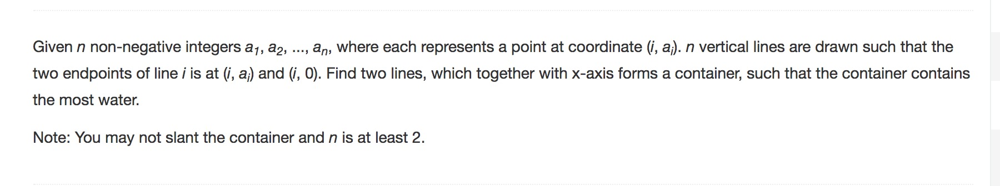

Question:




```python
class Solution(object):
	def maxArea(self, height):
		"""
		:type height: List[int]
		:rtype: int
		"""
		max_area = 0
		i = 0
		j = len(height)-1

		# i as an index of left
		# j as an index of right
		while(i < j):
			# a1 is left's height, while a2 is height of right 
			a1 = height[i]
			a2 = height[j]

			# calculate area(a1,a2), and compare with min_area we find so far
			max_area = max(min(a1,a2)*(j-i), max_area )
			
			# if a1 is less, move left index to right may increase area
			# else move right to left
			if a1 < a2: i+=1
			else : j-=1
```

