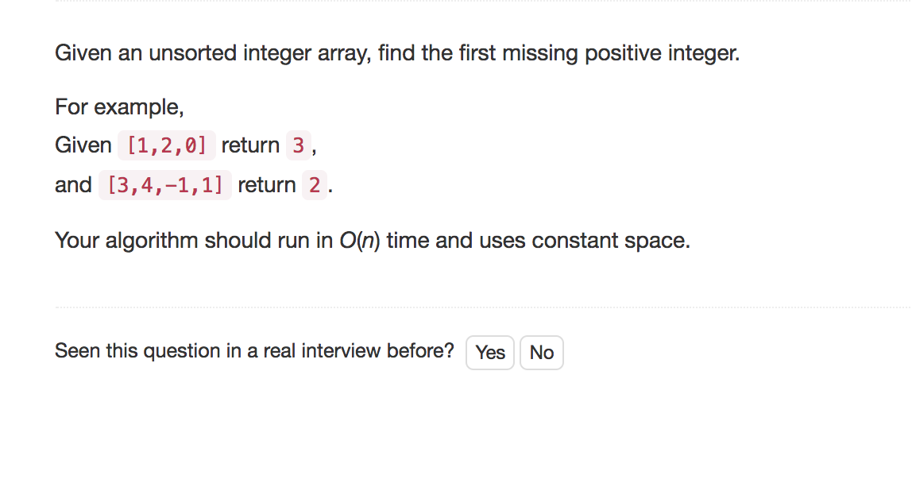

This is a very interesting question coming from Leetcode


Question:





Solution:


```python
class Solution:
	def firstMissingPositive(self, nums):
		"""
		:type nums: List[int]
		:rtype: int
		"""


		# create masked variable a as 0x00
		masked = 0x00
		length = len(nums)

		# one for loop for retrieving all positive nums 
		for num in nums:
			if num > 0 and num <= length: # the possible largest missing positive num is length+1
				masked |= (0x01) << num-1  # set masked at postion nums-1 to 1

		for i in range(length): # one for loop to find missing smallest interger
			if not masked&( (0x01) << i): # check if there is a interger i+1 in nums
				return i+1	# if not, return i+1
		return len(nums)+1 


```

Comments:

Using binary operations helps running time to be O(n) and space cost to be O(1).

Pruning  ```num > 0 and num <= length```  extremely imporves running time (we can prune big integer immediately and don't need to expand variable masked).