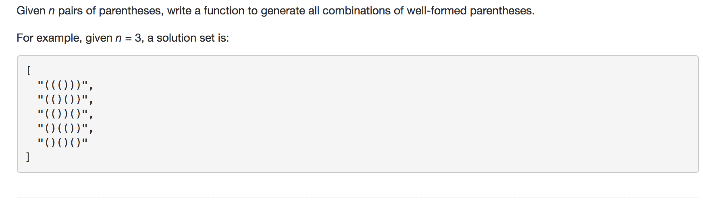

question comes from Leetcode





solution 


```python
class Solution(object):
	def generateParenthesis(self, n):
		"""
		:type n: int
		:rtype: List[str]
		"""
		if n <= 0:
			return []
		string = '('*n  # first we set all left bracket

		re = [] # we don't have duplication cases in this algorithm so we don't need to use set

		foo(string,0,1,n,re)
		return re


def foo(string,current,l_reminder,total,result):
	'''
	string: 
		dtype:int 
		is a substring of combinations of well-formed parentheses string
	current: 
		dtype:int
		track where is our current left bracket
	l_reminder: 
		dtype:int 
		track how many right brackets can put for current left bracket
	total: 
		dtype:int
		track how many right brackets need to make whole string be well-formed
	'''


	# consider base case
	# if we current at last left bracket, we only need to add total left number of right bracket
	if current == len(string)-1:
		string += ')'*total
		result.append(string)
		return

	# if not base case
	# we split string as two part by current position
	left_part = string[:current+1]
	right_part = string[current+1:]

	# we add different right brackerts for current left bracket and recursively call self 
	for i in range(l_reminder+1):
		temp_string = left_part+')'*i+right_part
		temp_current = current+i+1
		foo(temp_string,temp_current,l_reminder+1-i,total-i,result)

	return


 
```

