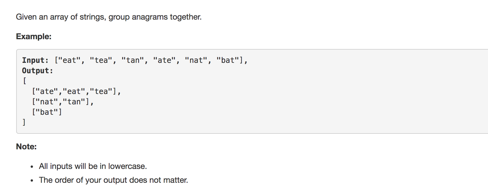

question comes from leetcode





solution:


```python
class Solution1:
	def groupAnagrams(self, strs):
		"""
		:type strs: List[str]
		:rtype: List[List[str]]
		"""

		mydict = {}
		for s in strs:
			news = "".join(sorted(s))
			try:
				mydict[news].append(s)
			except KeyError as e:
				mydict[news] = [s]

		return list(mydict.values())


class Solution2:
	'''
	using defaultdict 

	class collections.defaultdict([default_factory[, ...]])

	__missing__(key)
	If the default_factory attribute is None, 
	this raises a KeyError exception with the key as argument.

	If default_factory is not None, 
	it is called without arguments to provide a default value for the given key,
	this value is inserted in the dictionary for the key, and returned
	'''
	def groupAnagrams(self, strs):
		"""
		:type strs: List[str]
		:rtype: List[List[str]]
		"""
		import collections

		mydict = collections.defaultdict(list)

		for s in strs:
			news = "".join(sorted(s))
			mydict[news].append(s)

		return list(mydict.values())


```

