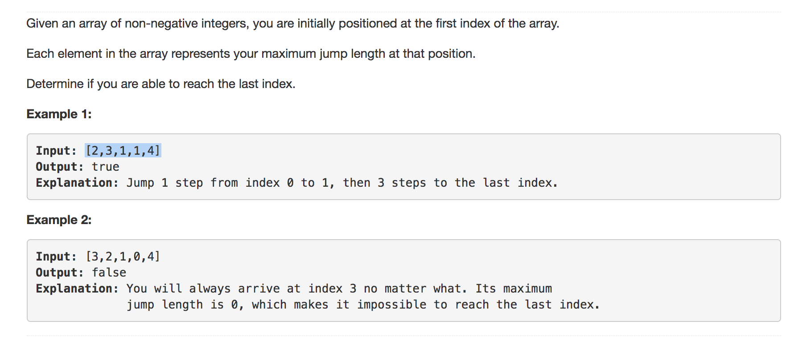

question:




solution:

```python
class Solution1:
	def canJump(self, nums):
		"""
		:type nums: List[int]
		:rtype: bool
		"""
        
		max_distance = nums[0] # init how far we can search
        
		for k,v in enumerate(nums):
			# if we so far cannot reach k, return False
			if k > max_distance:
				return False
			max_distance = max(k+v,max_distance) # update max distance we can search

			if max_distance >= len(nums): #  current max search distance already bigger than len(nums)
				return True
		# done loop, result True
		return True


class Solution2:
	def canJump(self, nums):
		"""
		:type nums: List[int]
		:rtype: bool
		"""

		# end is the last nums
		end = nums[-1]

		# let current from len(nums-1) down to 0
		# if current can reach end, update end as current
		for current in range(len(nums)-1,0,-1):
			if nums[current] + current >= end:
				end = current
		# check if first nums can reach end
		return nums[0] >= end


```

