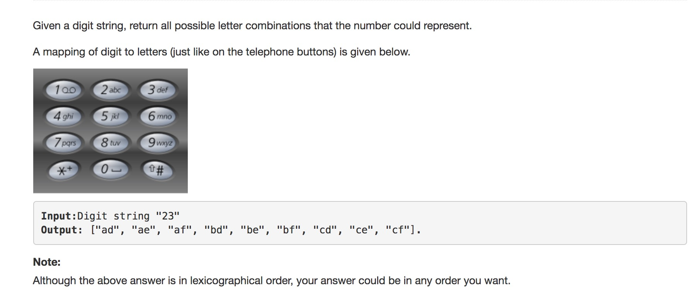

question comes from leetcode




solution:


```python

class Solution(object):
    def letterCombinations(self, digits):
        """
        :type digits: str
        :rtype: List[str]
        """
        if digits == None:
        	return []
        if len(digits) < 1:
        	return []     

        # here we create a dict convert digit whose dtype is char into chars
        digit_char_dict = { '1':"",\
        					'2':"abc", \
        					'3':"def",\
        					'4':"ghi",\
        					'5':"jkl",\
        					'6':"mno",\
        					'7':"pqrs",\
        					'8':"tuv",\
        					'9':"wxyz",\
        					'0':" "}
        # re dtype list and each contains a string
        re = []

        # main recursive function 
       	foo(digit_char_dict,digits,0,len(digits),"",re)

       	return re


def foo(digit_char_dict,digits,deep,max_lenght,substring,result):
	'''
	parameter:
		digit_char_dict: dtype: dict{},
			convert digit whose dtype is char into chars
		digits: dtype: list[],
			a list contains all digit chars
		deep: dtype: int
			a index of digits to tack how far we retrieved
		max_length: dtype: int
			len(digits)
		substring: dtype: str
			a string contains current combination of chars
	return:
		result: dtype: list
			contains all combination of digits' chars

	'''	


	digit = digits[deep]
	deep+=1

	if max_lenght == deep:
		# base cases
		for e in digit_char_dict[digit]:
			tempstr = substring
			tempstr += e
			result.append(tempstr)
		return

	# add current char into substring and call next level foo
	for e in digit_char_dict[digit]: # a b c
		tempstr = substring + e
		foo(digit_char_dict,digits,deep,max_lenght,tempstr,result)
	return


```


