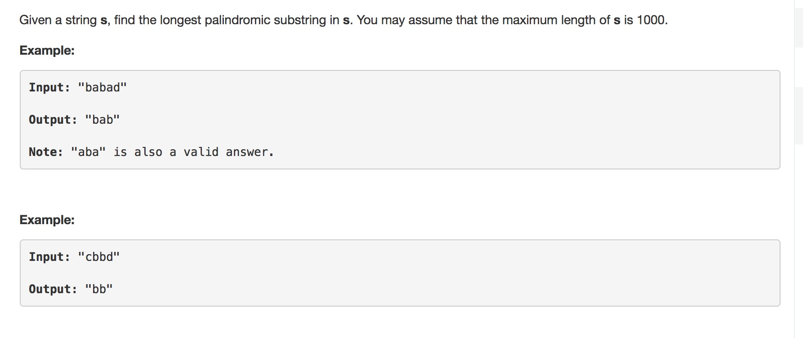

This question is from Leetcode 



```c
/*-------------------
runtime O(n^2)
for each index i in string:
	find jth string where string[j] = string[i]
		if same char:
			if length > max_length:
				save in result
		else:
			for each pair(i = i+1,j = j-1) and i<j:
				check string[i] == string[j]
			if substring is candicate result
				if length > max_length
					save in result
	j++
	if j reaches last index:
		i++
-------------------*/
char* longestPalindrome(char* s) {


    int begin = 0;
    int end = 0;
    int re_begin = 0;
    int left,right;
    int is_palindrome = 0;
    int max_length = 1;
    int same_char = 1;

    while(s[begin]){
    	if (s[begin] == s[end]){
    		is_palindrome = 1;
    		if (!same_char){
	    		for (left = begin+1,right = end-1;left<right && is_palindrome;left++,right--){
	    			if (s[left] != s[right]){
	    				is_palindrome = 0;
	    			}
	    		}
    		}
    		if(is_palindrome && ((end+1-begin) > max_length) ){
				max_length = (end - begin+1);
				re_begin = begin;
    		}
    	}else if(same_char){
    		same_char = 0;
    	}
    	end+=1; 
    	if (!s[end]){
    		begin+=1;
    		end = begin;
    		same_char = 1;
    	}
    }

    char*result =  malloc(sizeof(char)*(max_length+1));
    for (int i = 0; i < max_length; i++){
    	result[i] = s[i+re_begin];
    }
    result[max_length] = '\0';

    return result;
}
```

