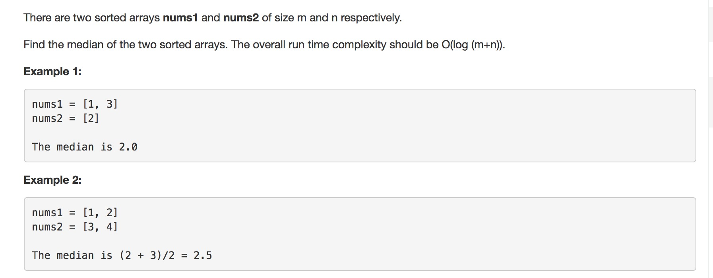

#### Question:




#### Answer:

```c
int min(int a, int b){
	return (a>b) ? b : a;
}
int max(int a, int b){
	return (a>b) ? a : b;
}

double findMedianSortedArrays(int* nums1, int nums1Size, int* nums2, int nums2Size) {

	// if one array is null
	if (nums1Size == 0 && nums2Size > 0){
		return (nums2Size%2 == 1) ? nums2[nums2Size/2] : 0.5*(nums2[(nums2Size-1)/2]+nums2[(nums2Size-1)/2+1]);
	}
	if (nums2Size == 0 && nums1Size > 0){
		return (nums1Size%2 == 1) ? nums1[nums1Size/2] : 0.5*(nums1[(nums1Size-1)/2]+nums1[(nums1Size-1)/2+1]);
	}

	// both null return 0
	if (!nums1Size && !nums2Size){
		return 0;
	}

	// both not null
	int mid_num = (nums1Size + nums2Size)/2;
	int i = (nums1Size-1)/2; // i as n's mid point
	int j = mid_num - (i+1) - 1; //j as m's mid point

	int next_i = i+1, next_j = j+1;
	int n_result = 0, m_result = 0;

	int n_left,n_right,m_left,m_right;
	int done = 0;

	do{
		//impossible to have else case unless two arrays are not sorted
		if (next_i > nums1Size -1){
			n_right = INT32_MAX; 
			n_left = nums1[i];
		}else if (i < 0){
			n_left = INT32_MIN;
			n_right = nums1[next_i];
		}else{
			n_left = nums1[i];
			n_right = nums1[next_i];
		}
		//check j+1 and j
		if(next_j > nums2Size -1){
			m_right = INT32_MAX;
			m_left = nums2[j];
		}else if (j < 0){
			m_left = INT32_MIN;
			m_right = nums2[next_j];
		}else{
			m_left = nums2[j];
			m_right = nums2[next_j];
		}
		//check if find result
		if( n_left <= m_right && n_right >= m_left){
			done = 1;
		}else if(n_left > m_right){
			j+=1;
			next_j+=1;
			i-=1;
			next_i-=1;
		}else if(n_right < m_left){
			j-=1;
			next_j-=1;
			i+=1;
			next_i+=1;
		}
		
	} while (!done);

	int max_left = max(n_left,  m_left);
	int min_right = min(n_right, m_right);

    return ((nums1Size + nums2Size)%2 == 1) ? min_right : 0.5*(min_right+max_left);
}
```


