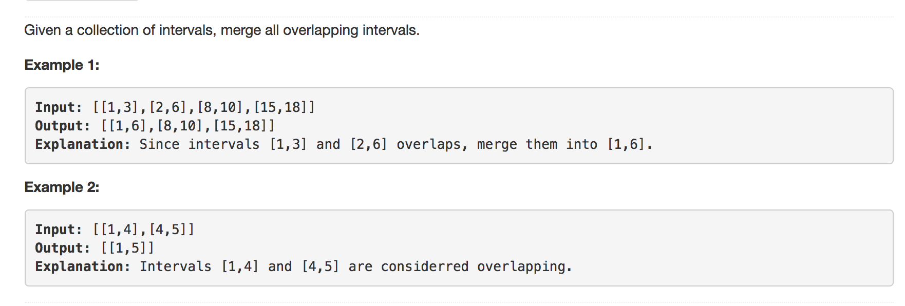

question




solution

```python

# Definition for an interval.
class Interval:
	def __init__(self, s=0, e=0):
		self.start = s
		self.end = e


class Solution1:
	def merge(self, intervals):
		"""
		:type intervals: List[Interval]
		:rtype: List[Interval]
		"""

		# diff the change of intervals' length after every iteration
		length_diff = 1

		while(length_diff):

			last_intervals_len = len(intervals) # set last_intervals_len

			# iteration begins
			for current_index,current in enumerate(intervals):
				for compare_index,i in enumerate(intervals) :

					# for each pair(i1,i2) and i1!=i2, merge them
					if i != current and self.intervals_concatenate(current,i):
						intervals.pop(compare_index) # if they overlap each other, pop i2

			length_diff = last_intervals_len - len(intervals) # update diff


			
		return intervals

	def intervals_concatenate(self, i1,i2):
		'''
		i1: Interval
		i2: Interval
		return 1 if i1 overlaps i2
		return 0 if i1 does not overlap i2
		'''

		if i2.start <= i1.end and i2.start >= i1.start:
			i1.start = min(i1.start,i2.start)
			i1.end = max(i2.end,i1.end)
			return 1

		if i1.start <= i2.end and i1.start >= i2.start:
			i1.start = min(i1.start,i2.start)
			i1.end = max(i2.end,i1.end)
			return 1
		
		return 0


'''	
def mylt(self,other):
	return self.start <= other.start

# overwirte own sort function
Interval.__lt__ = mylt 
intervals.sort() # sort interval
'''

class Solution2:
	def merge(self, intervals):
		"""
		:type intervals: List[Interval]
		:rtype: List[Interval]
		"""

		result_intervals = []
		current = None
		for i in sorted(intervals,key=lambda current: current.start):
			# for each pair(i1,i2) if i1 and i2 overlap each other
			if result_intervals  and i.start <= current.end:
				current.end = max(i.end,current.end) # update current.end
			else:
				result_intervals.append(i) # else add current into result
				current = i

		return result_intervals

```

