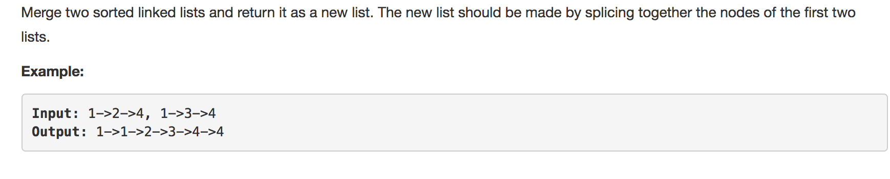

question comes from LeetCode





solution:


```python
class Solution(object):
	def mergeTwoLists(self, l1, l2):
		"""
		:type l1: ListNode
		:type l2: ListNode
		:rtype: ListNode
		"""
		
		# let left = l1 and right = l2	
		left = l1
		right = l2

		# create a head and let current = head
		head = ListNode(None)
		current = head

		# while left and right are not null 
		while(left and right):
			if left.val >= right.val: # if left value > right value, then connect right to current
				current.next = right  
				current = current.next # move current
				right = right.next  # move right
			else:
				current.next = left 
				current = current.next
				left = left.next

		# either left or right is null, connect not null one to current 
		if not left: 
			current.next = right
		else:
			current.next = left

		# return head's next => l1 or l2
		return head.next

```

