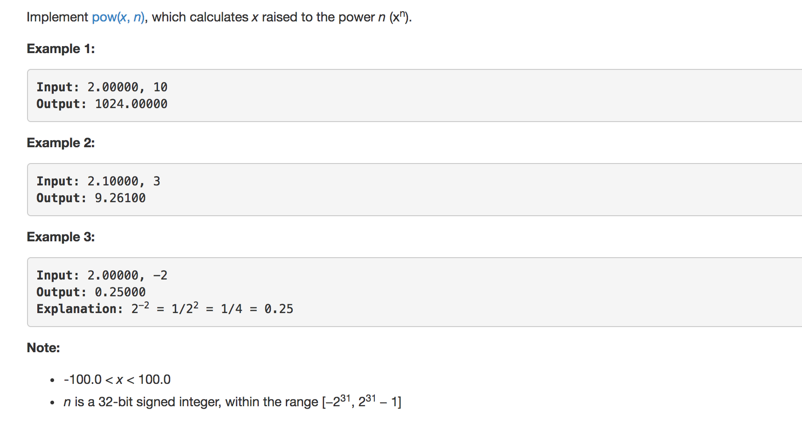

question(Leetcode):





solution

```python
class Solution:
	def myPow(self, x, n):
		"""
		:type x: float
		:type n: int
		:rtype: float
		"""

		# convert x^-n into (1/x)^n
		if n < 0:
			x = 1.0/x
			n*=-1

		# special cases
		if x == 1.0 or x == 0.0:
			return x
		# base case
		if n == 0:
			return 1

		# find the result of x^(n/2)
		result = self.myPow(x,n//2)

		# if n odd return  x^(n/2)*x^(n/2)*x, else x^(n/2)*x^(n/2)
		if n%2:
			return result*result*x
		else:
			return result*result
```

