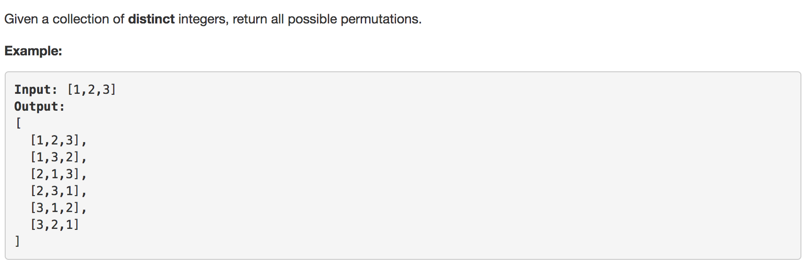

Question comes from LEETCODE





Solution:

```python
class Solution:
	def permute(self, nums):
		"""
		:type nums: List[int]
		:rtype: List[List[int]]
		"""

		# base case nums is empty
		if nums == []:
			return []

		# set return type result  
		result = []


		# extra a num in nums, set num at first position and find permutation of reminder nums
		for index,num in enumerate(nums):
			for other in self.permute(nums[:index]+nums[index+1:]) or [[]]:	

				# result append [num] + each order in permuation of reminder nums
				result.append([num]+other)


		return result
```

