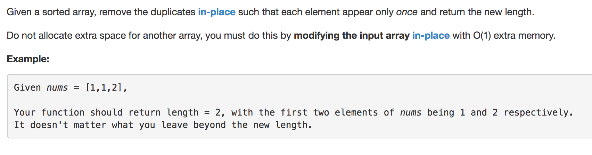

question from Leetcode





solutions:


```python
class Solution:
	def removeDuplicates(self, nums):
		"""
		:type nums: List[int]
		:rtype: int
		"""

		# delete duplicate element when duplication occurs
		i = 0
		last = None
		while (i < len(nums)):
			item = nums[i]
			if last == item:
				del nums[i]
			else:
				last = item
				i += 1
                
		return len(nums)

class Solution2:
	def removeDuplicates(self, nums):
		"""
		:type nums: List[int]
		:rtype: int
		"""

		if not len(nums):
			return 0

		# use two pointers and change list directly without changing list's size
		j = 0
		for i in range(len(nums)):
			if nums[j] != nums[i]:
				nums[j+1] = nums[i]
				j+=1

		return j+1


# solution from user ahendy in LeetCode 
from collections import OrderedDict
class Solution3(object):
	def removeDuplicates(self, nums):
		# Create a new dictionary with keys from seq and values set to value.
		# use key() function to get keys list, since it is dict, so it is sorted array
		nums[:] =  OrderedDict.fromkeys(nums).keys()
        
		return len(nums)

```


Running time:  Solution2 < Solution3 < Solution1