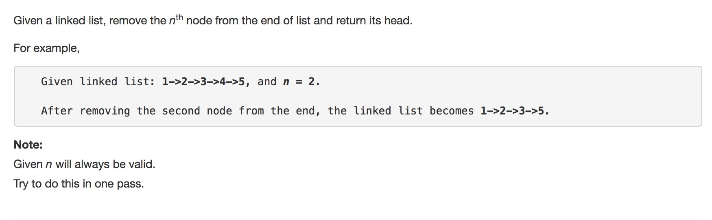

question comes from Leetcode




solution 


```python
class Solution(object):
	def removeNthFromEnd(self, head, n):
		"""
		:type head: ListNode
		:type n: int
		:rtype: ListNode
		"""

		# tracks of lleft -> left -> ..... -> right 
		# where the distance of left and right is n nodes
		# when right touch base, which means right is None
		# we need to remove left
		# so only thing we need is to connect lleft and left.nxet 
		left = head
		right = head
		lleft = ListNode(None)
		lleft.next = left

		for i in range(n):
			right = right.next

		# consider special cases our root node is removed
		# we directly return left.next
		if not right:
			return left.next


		while(right):
			lleft = lleft.next
			right = right.next
			left = left.next

		# remove left
		lleft.next = left.next

		return head
```


