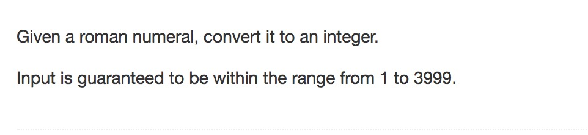

question from leetcode




```python
'''
runtime cost O(n)

algorithm:
for any XY 
    if X>=Y => result + X + Y
    else X<Y => result - X + Y
'''
class Solution(object):
	def romanToInt(self, s):
		"""
		:type s: str
		:rtype: int
		"""

		#dict[k] = v, k = roman char,v = int
		roman_int_dict = {"I":1,"V":5,"X":10,"L":50,"C":100,"D":500,"M":1000,}
		re = 0
		last = -1
		for i in s:
			current = roman_int_dict[i]
			if last <0:
				pass
			elif last >= current:
				re += last
			else:
				re -= last
			last = current
		re += last

		return re

```

