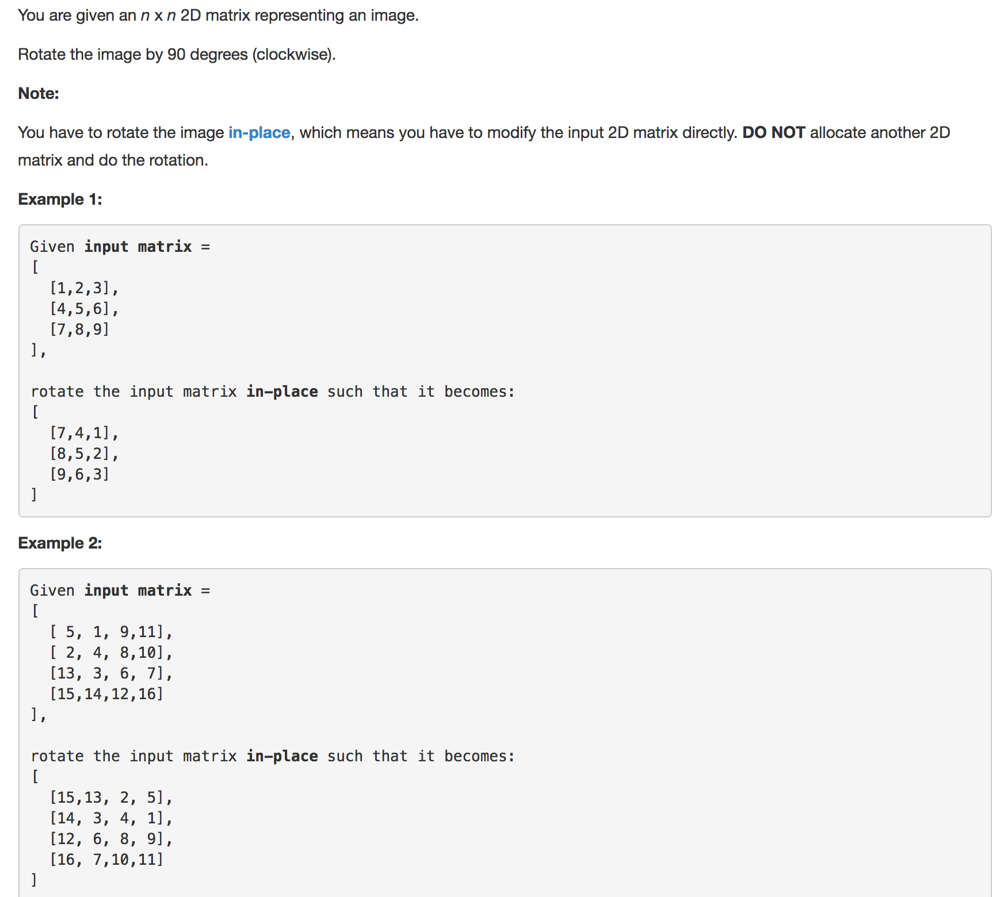

Question comes from leetcode




solution

```python
class Solution:
	def rotate(self, matrix):
		"""
		:type matrix: List[List[int]]
		:rtype: void Do not return anything, modify matrix in-place instead.
		"""

		size = len(matrix)

		# for each row, rotate row and related col
		for i in range(size):
			self.rotate_row(matrix,i)

		return


	def rotate_row(self,matrix,n):
		'''
		n is the row index 
		'''

		size = len(matrix)

		for j,v in enumerate(matrix[n][n:size-n-1]):

			# exchange each i,j 4 times
			temp,i,j = self.exchange(matrix,size,n,j+n,matrix[n][j+n])
			temp,i,j = self.exchange(matrix,size,i,j,temp)
			temp,i,j = self.exchange(matrix,size,i,j,temp)
			temp,i,j = self.exchange(matrix,size,i,j,temp)

		return

	def exchange(self,matrix,size,i,j,value):
		'''
		size is the matrix size
		i,j is the position that is rotated
		value is value new position needs to be assigned
		'''
		
		temp = matrix[j][size-1-i]
		matrix[j][size-1-i] = value
		return temp,j,size-1-i

```

