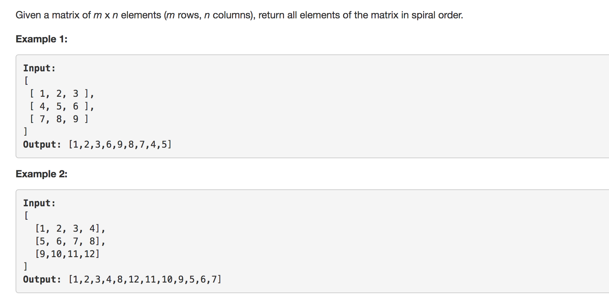

question comes from leetcode





```python


class Solution1:
	def spiralOrder(self, matrix):
		"""
		:type matrix: List[List[int]]
		:rtype: List[int]
		"""
		result = []

		if len(matrix) <= 0:
			return result

		self.foo(matrix,result,0,0)

		return result

	def foo(self,matrix,result,i,j):
		'''
		every time only add most outer rows and cols into result
		i,j is the start point, we add elemtents clockwise 
		then i+1,j+1 => go to inner matrix

		1 	2 	3 	4
		5	6 	7 	8
		9 	10	11	12

		first add 1 2 3 4 8 12, 11 10 9 5
		then go to inner matrix [5,6]
		then add 5,6
		done 

		'''

		n = len(matrix)
		m = len(matrix[0])

		if  i >=n or j >= m or matrix[i][j] == '#':
			return 

		# top row	
		for col in range(j,m-j):
			if matrix[i][col] != '#':
				result.append(matrix[i][col]) 
				matrix[i][col] = '#'

		# right col
		for row in range(i,n-i):
			if matrix[row][m-j-1] != '#':
				result.append(matrix[row][m-j-1])
				matrix[row][m-j-1] = '#'
		# bot row 
		for col in range(m-2*j):
			if matrix[n-i-1][m-j-1-col] != '#':
				result.append(matrix[n-i-1][m-j-1-col])
				matrix[n-i-1][m-j-1-col] = '#'
		# left col
		for row in range(n-2*i):
			if matrix[n-i-1-row][j] != '#':
				result.append(matrix[n-i-1-row][j])
				matrix[n-i-1-row][j] = '#'

		# go to inner matrix
		return self.foo(matrix,result,i+1,j+1)

class Solution2:
	'''
	using python3 zip 
	idea comes from Leetcode user StefanPochmann
	'''

	def spiralOrder(self, matrix):
		result = []
		while(matrix):
			# remove top row and add it in to result
			result += matrix.pop(0)

			# rotate clockwise
			matrix = list(zip(*matrix[:]))[::-1]
			
		return result
			

```

