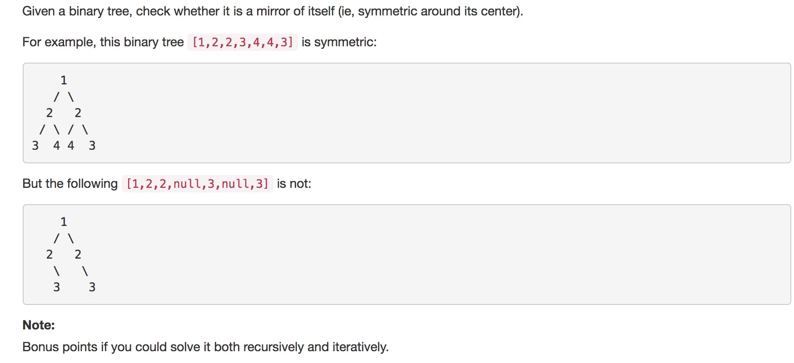

#### Question




#### Answer: 

```c

#include <unistd.h>
#include <stdio.h>
#include <string.h>
#include <stdlib.h>
#include <time.h>
#include <signal.h>
#include <unistd.h>
/*
Algorithm
	recursively
	1. check left == right 
	2. function call (left_left,right_right) and (left_right,right_left)
*/
int solution_v1(int*array, int left, int right, int max){
	int left_left = left*2+1;
	int left_right = left*2+2;
	int right_right = right*2+2;
	int right_left = right*2+1;
    
    if (max == 0){
        return 1;
    }
    
	// first check current left == right
	if (array[left] != array[right]){
		return 0;
	}
    
	//if left == right then
	// check if both are left nodes
	if (left_left >= max){
		// if root
		if (left == right ){
            return 1;
        }
		// if current left and right are leaf nodes
		return array[left] == array[right];
	}else if(left_left < max && right_right < max){

		// if root with full children 
		if (left == right){
			return solution_v1(array,left_left,right_right,max);
		}
		// if current left and right both have children
		return solution_v1(array,left_left,right_right,max) && 
				solution_v1(array,left_right,right_left,max);
	}else{
		// if some of them have some children, it can not be mirror case
		return 0;
	}
}


```

```c
/**
 * Definition for a binary tree node.
 * struct TreeNode {
 *     int val;
 *     struct TreeNode *left;
 *     struct TreeNode *right;
 * };
 */

/*
Algorithm is same as above 
*/

int solution_v1(struct TreeNode *left, struct TreeNode *right){
    
    if (left == NULL && right == NULL){
        return 1;
    }
    
	if (left->val != right->val){
		return 0;
	}
    
    int r1,r2;
    
    if(left->left != NULL && right->right != NULL){
        r1 = solution_v1( (left->left), (right->right));
    }else if (left->left == NULL && right->right == NULL){
        r1 = 1;
    }else{
        return 0;
    }

   	if (left == right){
        //root 
        return r1;
    }
    
    
    if(right->left != NULL && left->right != NULL){
        r2 = solution_v1( (left->right), (right->left));
    }else if (right->left == NULL && left->right == NULL){
        r2 = 1;
    }else{
        return 0;
    }

    return r1&&r2;   
}
```


