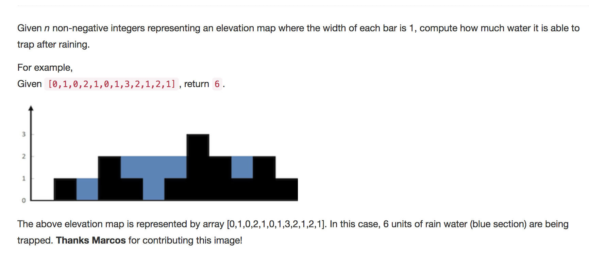

Question comes from leetcode


question:




solution:

```python
class Solution:
	def trap(self, height):
		"""
		:type height: List[int]
		:rtype: int
		"""

		if not height:
			return 0

		left = 0
		right = len(height)-1
		total_area = 0		

		if height[left] <= height[right]:
			m = left
		else:
			m =right

		while(left < right):
			if height[left] <= height[right]:
				# move m from left to right
				m += 1				
				if height[m] >= height[left]:
					# found a local convave shape 
					left = m # search the remainder part from [m,right]
					m = left if height[left] <= height[right] else right # reset m as min hight between left and right
				else:
					# since right is higher than left, we can guarantee that
					# each index in interval (left,right) will increase height[left]-height[m] 's water trapped area
					total_area += height[left]-height[m]
			else:
				# move m from right to left
				m-=1
				if height[m] >= height[right]:
					# found a local convave shape 
					right = m
					m = left if height[left] <= height[right] else right
				else:
					# same as left part above
					total_area += height[right]-height[m]

		return total_area
```


comments:

Running time O(n), while space costs O(1)