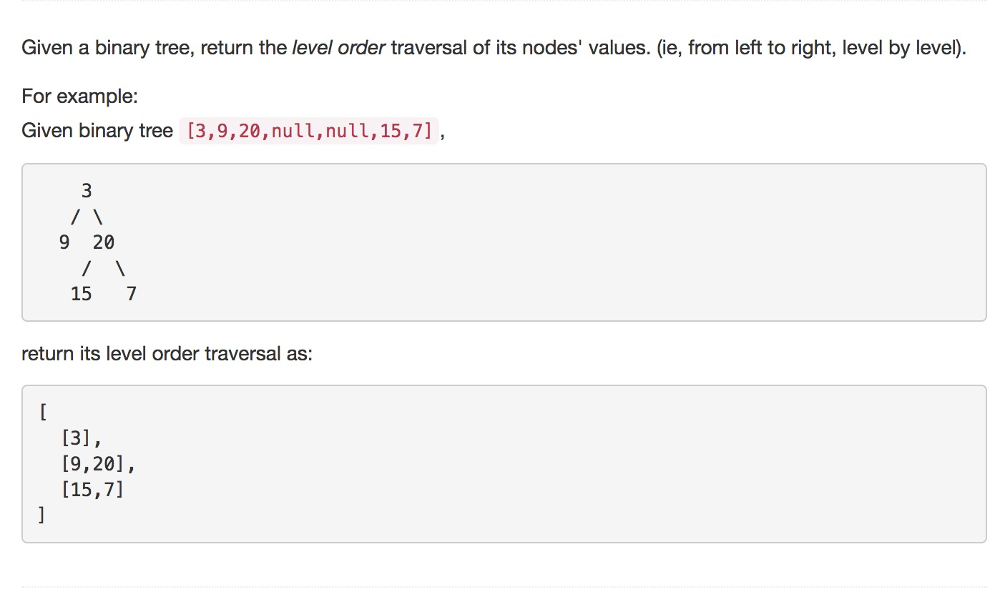

#### Question:



#### Answer

```c

int** solution_v1(struct TreeNode *current, int **result, int **columnSizes, int *returnSize, int depth){

	//if root is NULL return 
    if (current == NULL){
        return result;
    }

   	int next_depth = depth+1;
	struct TreeNode *left = current->left;
	struct TreeNode *right = current->right;

	// current depth is n then next-depth is n+1
	// assume we already in left nodes
	// returnSize should be n+1 which is same as value of next depth
	// if returnSize,the max depth, is less than next depth
	// we find a deeper level (current level)
    if (*returnSize < next_depth) {

    	//increase *returnSize
        *returnSize = next_depth;

        //increase result depth by 1 to reach current level
        result = realloc(result, (depth + 1) * sizeof(int *));
        
        // set it as NULL
        (result)[depth] = NULL;

    	//add 1 more column
        *columnSizes = realloc(*columnSizes, (depth + 1) * sizeof(int));

        //current index as 0
        (*columnSizes)[depth] = 0;
    }
    
    //expand result array at current level by 1 int
    (result)[depth] = realloc((result)[depth], ((*columnSizes)[depth] + 1) * sizeof(int));
    (result)[depth][(*columnSizes)[depth]] = current->val;
    (*columnSizes)[depth] += 1;
   		
   	// if it has left child
    if (left != NULL){
    	result = solution_v1(left,  result, columnSizes, returnSize,next_depth);
    }

    //if it has right child
    if (right != NULL){
	    result = solution_v1(right, result, columnSizes, returnSize,next_depth);
    }

    return result;
}


int** levelOrder(struct TreeNode* root, int** columnSizes, int* returnSize) {
    int **result;
    result = NULL;
    *returnSize = 0;
    result = solution_v1(root, result, columnSizes, returnSize,0);
    
    return result;
}
```

