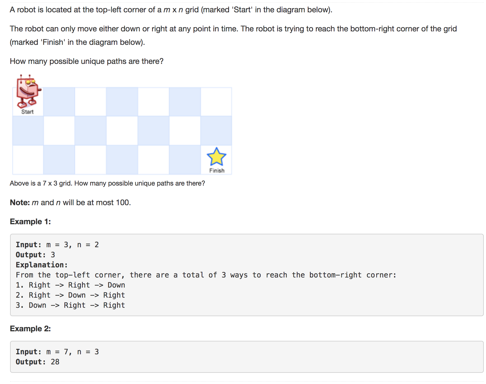

question




solution:

```python
class Solution1:
	def uniquePaths(self, m, n):
		"""
		:type m: int
		:type n: int
		:rtype: int
		"""
	
		'''
		explain:
			combination math problem 
			the path's length is n+m-2, choose n-1 going to right 
		'''

		import math
		return math.factorial(m+n-2)//(math.factorial(n-1)*math.factorial(m+n-2-n+1))

class Solution2:
	def uniquePaths(self, m, n):
		"""
		:type m: int
		:type n: int
		:rtype: int
		"""
	
		'''
		dynamic question, sort each path(m,n) in mytrack 
		Path(m,n) =  Path(m-1,n)+ Path(m,n-1)
		'''
		import collections
		mytrack = collections.defaultdict(int)

		return self.foo(m,n,mytrack)


	def foo(self,m,n,track):
		if n == 1 or m == 1:
			# base case return 1
			track[(min(n,m),max(m,n))] = 1
			return 1

		else:
			# find data in track
			left =  track[min((m-1,n)),max((m-1,n))]
			right = track[min((m,n-1)),max((m,n-1))]

			# if track does not contain result, call foo find result
			if not left:
				left = self.foo(min((m-1,n)),max((m-1,n)),track)

			if not right:
				right = self.foo(min((m,n-1)),max((m,n-1)),track)

			# store info into track
			track[(min(n,m),max(m,n))] = right+left

			# return result
			return left+right


```

