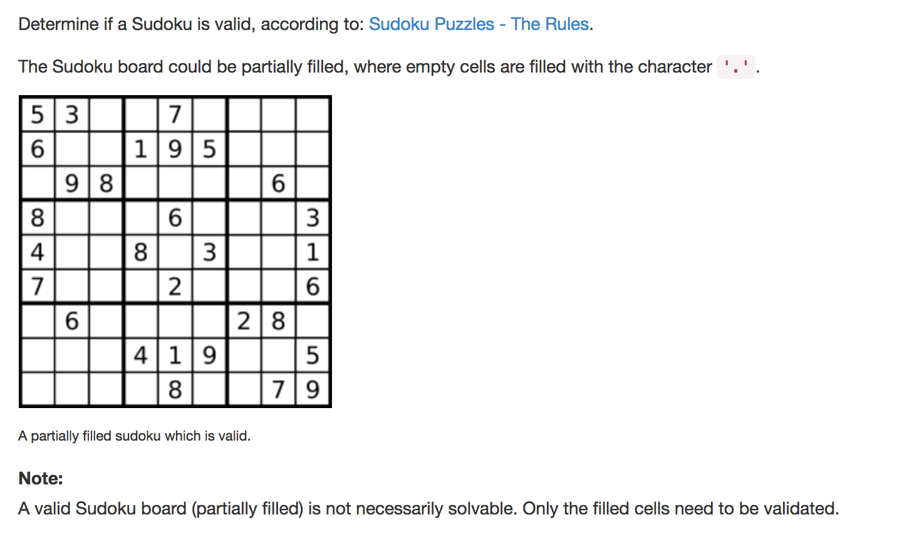

question comes from leetcode





solution:

```python
class Solution:
	def isValidSudoku(self, board):
		"""
		:type board: List[List[str]]
		:rtype: bool
		"""
		
		re = 1

		for i in range(9):
			# each row
			row = board[i]
			re &= self.check_list(row)

			# each column
			column = [row[i] for row in board]
			re &= self.check_list(column)

			# each block 
			# block's top left elemtents' indexes are (0,0), (3,0), (6,0), (3,0) .... (6,6)
			# we can use ( (i//3)*3, (i*3)%9 ) to get the position of each block's starting position
			block = [ board[(i//3)*3+j][i*3%9+k] for j in range(3) for k in range(3)]
			re &= self.check_list(block)

			if not re:
				return False

		return True


	def check_list(self, list_checkarray):

		if len(list_checkarray) != 9:
			return 0

		# array stores the count of # from 1-9
		# index of array = #-1
		number_arrayp = [ 0 for i in range(9)]

		for i in list_checkarray:
			if i == '.': # empty
				continue
			i = int(i)
			number_arrayp[i-1] +=1 # the count of i + 1 
			if number_arrayp[i-1]>1:
				return 0

		return 1
```

